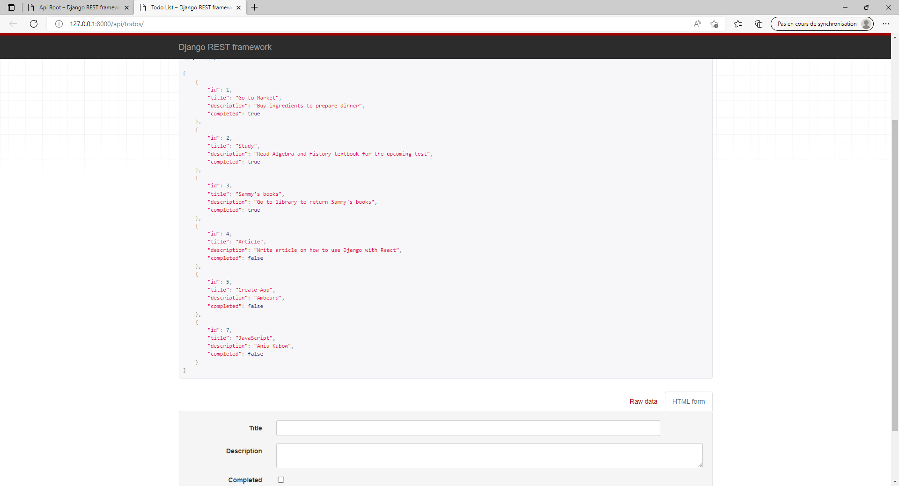

# django-todo-react


## Installation

```
pip install pipenv
```

```
pipenv shell
```

```
pipenv install django
```

```
django-admin startproject backend
```


```
python manage.py migrate

```

```
python manage.py runserver
```
### Application 

```
python manage.py startapp todo
```
backend/settings.py :
```py
# Application definition

INSTALLED_APPS = [
    'django.contrib.admin',
    'django.contrib.auth',
    'django.contrib.contenttypes',
    'django.contrib.sessions',
    'django.contrib.messages',
    'django.contrib.staticfiles',
    'todo',
]
```
todo/models.py :
```py
from django.db import models

# Create your models here.

class Todo(models.Model):
    title = models.CharField(max_length=120)
    description = models.TextField()
    completed = models.BooleanField(default=False)

    def _str_(self):
        return self.title
```


```
python manage.py makemigrations todo
python manage.py migrate todo
```

todo/admin.py :
```py
from django.contrib import admin
from .models import Todo

class TodoAdmin(admin.ModelAdmin):
    list_display = ('title', 'description', 'completed')

# Register your models here.

admin.site.register(Todo, TodoAdmin)
```

```
python manage.py createsuperuser
```

```
python manage.py runserver
```

```
http://localhost:8000/admin
```

### API

```
pipenv install djangorestframework django-cors-headers
```

backend/settings.py :
```py
# Application definition

INSTALLED_APPS = [
    'django.contrib.admin',
    'django.contrib.auth',
    'django.contrib.contenttypes',
    'django.contrib.sessions',
    'django.contrib.messages',
    'django.contrib.staticfiles',
    'corsheaders',
    'rest_framework',
    'todo',
]

MIDDLEWARE = [
    'django.middleware.security.SecurityMiddleware',
    'django.contrib.sessions.middleware.SessionMiddleware',
    'django.middleware.common.CommonMiddleware',
    'django.middleware.csrf.CsrfViewMiddleware',
    'django.contrib.auth.middleware.AuthenticationMiddleware',
    'django.contrib.messages.middleware.MessageMiddleware',
    'django.middleware.clickjacking.XFrameOptionsMiddleware',
    'corsheaders.middleware.CorsMiddleware',
]

....


CORS_ORIGIN_WHITELIST = [
     'http://localhost:3000'
]
```
todo/serializers.py :
```py
from rest_framework import serializers
from .models import Todo

class TodoSerializer(serializers.ModelSerializer):
    class Meta:
        model = Todo
        fields = ('id', 'title', 'description', 'completed')
```
todo/views.py:
```py
from django.shortcuts import render
from rest_framework import viewsets
from .serializers import TodoSerializer
from .models import Todo

# Create your views here.

class TodoView(viewsets.ModelViewSet):
    serializer_class = TodoSerializer
    queryset = Todo.objects.all()
```

backend/urls.py :
```py
from django.contrib import admin
from django.urls import path, include
from rest_framework import routers
from todo import views

router = routers.DefaultRouter()
router.register(r'todos', views.TodoView, 'todo')

urlpatterns = [
    path('admin/', admin.site.urls),
    path('api/', include(router.urls)),
]
```

```
python manage.py runserver
```
http://localhost:8000/api/todos

### Frontend

```
npx create-react-app frontend
```

```
cd frontend
npm start
```

```
npm install bootstrap@4.6.0 reactstrap@8.9.0 --legacy-peer-deps
```

frontend/src/index.js
```js
import React from 'react';
import ReactDOM from 'react-dom';
import 'bootstrap/dist/css/bootstrap.css';
import './index.css';
import App from './App';
import reportWebVitals from './reportWebVitals';

ReactDOM.render(
  <React.StrictMode>
    <App />
  </React.StrictMode>,
  document.getElementById('root')
);

// If you want to start measuring performance in your app, pass a function
// to log results (for example: reportWebVitals(console.log))
// or send to an analytics endpoint. Learn more: https://bit.ly/CRA-vitals
reportWebVitals();
```

frontend/src/App.js

```js
import React, { Component } from "react";

const todoItems = [
  {
    id: 1,
    title: "Go to Market",
    description: "Buy ingredients to prepare dinner",
    completed: true,
  },
  {
    id: 2,
    title: "Study",
    description: "Read Algebra and History textbook for the upcoming test",
    completed: false,
  },
  {
    id: 3,
    title: "Sammy's books",
    description: "Go to library to return Sammy's books",
    completed: true,
  },
  {
    id: 4,
    title: "Article",
    description: "Write article on how to use Django with React",
    completed: false,
  },
];

class App extends Component {
  constructor(props) {
    super(props);
    this.state = {
      viewCompleted: false,
      todoList: todoItems,
    };
  }

  displayCompleted = (status) => {
    if (status) {
      return this.setState({ viewCompleted: true });
    }

    return this.setState({ viewCompleted: false });
  };

  renderTabList = () => {
    return (
      <div className="nav nav-tabs">
        <span
          className={this.state.viewCompleted ? "nav-link active" : "nav-link"}
          onClick={() => this.displayCompleted(true)}
        >
          Complete
        </span>
        <span
          className={this.state.viewCompleted ? "nav-link" : "nav-link active"}
          onClick={() => this.displayCompleted(false)}
        >
          Incomplete
        </span>
      </div>
    );
  };

  renderItems = () => {
    const { viewCompleted } = this.state;
    const newItems = this.state.todoList.filter(
      (item) => item.completed == viewCompleted
    );

    return newItems.map((item) => (
      <li
        key={item.id}
        className="list-group-item d-flex justify-content-between align-items-center"
      >
        <span
          className={`todo-title mr-2 ${
            this.state.viewCompleted ? "completed-todo" : ""
          }`}
          title={item.description}
        >
          {item.title}
        </span>
        <span>
          <button
            className="btn btn-secondary mr-2"
          >
            Edit
          </button>
          <button
            className="btn btn-danger"
          >
            Delete
          </button>
        </span>
      </li>
    ));
  };

  render() {
    return (
      <main className="container">
        <h1 className="text-white text-uppercase text-center my-4">Todo app</h1>
        <div className="row">
          <div className="col-md-6 col-sm-10 mx-auto p-0">
            <div className="card p-3">
              <div className="mb-4">
                <button
                  className="btn btn-primary"
                >
                  Add task
                </button>
              </div>
              {this.renderTabList()}
              <ul className="list-group list-group-flush border-top-0">
                {this.renderItems()}
              </ul>
            </div>
          </div>
        </div>
      </main>
    );
  }
}

export default App;
```


```
mkdir src/components
```

src/components/Modal.js:
```js
import React, { Component } from "react";
import {
  Button,
  Modal,
  ModalHeader,
  ModalBody,
  ModalFooter,
  Form,
  FormGroup,
  Input,
  Label,
} from "reactstrap";

export default class CustomModal extends Component {
  constructor(props) {
    super(props);
    this.state = {
      activeItem: this.props.activeItem,
    };
  }

  handleChange = (e) => {
    let { name, value } = e.target;

    if (e.target.type === "checkbox") {
      value = e.target.checked;
    }

    const activeItem = { ...this.state.activeItem, [name]: value };

    this.setState({ activeItem });
  };

  render() {
    const { toggle, onSave } = this.props;

    return (
      <Modal isOpen={true} toggle={toggle}>
        <ModalHeader toggle={toggle}>Todo Item</ModalHeader>
        <ModalBody>
          <Form>
            <FormGroup>
              <Label for="todo-title">Title</Label>
              <Input
                type="text"
                id="todo-title"
                name="title"
                value={this.state.activeItem.title}
                onChange={this.handleChange}
                placeholder="Enter Todo Title"
              />
            </FormGroup>
            <FormGroup>
              <Label for="todo-description">Description</Label>
              <Input
                type="text"
                id="todo-description"
                name="description"
                value={this.state.activeItem.description}
                onChange={this.handleChange}
                placeholder="Enter Todo description"
              />
            </FormGroup>
            <FormGroup check>
              <Label check>
                <Input
                  type="checkbox"
                  name="completed"
                  checked={this.state.activeItem.completed}
                  onChange={this.handleChange}
                />
                Completed
              </Label>
            </FormGroup>
          </Form>
        </ModalBody>
        <ModalFooter>
          <Button
            color="success"
            onClick={() => onSave(this.state.activeItem)}
          >
            Save
          </Button>
        </ModalFooter>
      </Modal>
    );
  }
}
```
frontend/src/App.js:

```js
import React, { Component } from "react";
import Modal from "./components/Modal";

const todoItems = [
  {
    id: 1,
    title: "Go to Market",
    description: "Buy ingredients to prepare dinner",
    completed: true,
  },
  {
    id: 2,
    title: "Study",
    description: "Read Algebra and History textbook for the upcoming test",
    completed: false,
  },
  {
    id: 3,
    title: "Sammy's books",
    description: "Go to library to return Sammy's books",
    completed: true,
  },
  {
    id: 4,
    title: "Article",
    description: "Write article on how to use Django with React",
    completed: false,
  },
];

class App extends Component {
  constructor(props) {
    super(props);
    this.state = {
      viewCompleted: false,
      todoList: todoItems,
      modal: false,
      activeItem: {
        title: "",
        description: "",
        completed: false,
      },
    };
  }

  toggle = () => {
    this.setState({ modal: !this.state.modal });
  };

  handleSubmit = (item) => {
    this.toggle();

    alert("save" + JSON.stringify(item));
  };

  handleDelete = (item) => {
    alert("delete" + JSON.stringify(item));
  };

  createItem = () => {
    const item = { title: "", description: "", completed: false };

    this.setState({ activeItem: item, modal: !this.state.modal });
  };

  editItem = (item) => {
    this.setState({ activeItem: item, modal: !this.state.modal });
  };

  displayCompleted = (status) => {
    if (status) {
      return this.setState({ viewCompleted: true });
    }

    return this.setState({ viewCompleted: false });
  };

  renderTabList = () => {
    return (
      <div className="nav nav-tabs">
        <span
          className={this.state.viewCompleted ? "nav-link active" : "nav-link"}
          onClick={() => this.displayCompleted(true)}
        >
          Complete
        </span>
        <span
          className={this.state.viewCompleted ? "nav-link" : "nav-link active"}
          onClick={() => this.displayCompleted(false)}
        >
          Incomplete
        </span>
      </div>
    );
  };

  renderItems = () => {
    const { viewCompleted } = this.state;
    const newItems = this.state.todoList.filter(
      (item) => item.completed === viewCompleted
    );

    return newItems.map((item) => (
      <li
        key={item.id}
        className="list-group-item d-flex justify-content-between align-items-center"
      >
        <span
          className={`todo-title mr-2 ${
            this.state.viewCompleted ? "completed-todo" : ""
          }`}
          title={item.description}
        >
          {item.title}
        </span>
        <span>
          <button
            className="btn btn-secondary mr-2"
            onClick={() => this.editItem(item)}
          >
            Edit
          </button>
          <button
            className="btn btn-danger"
            onClick={() => this.handleDelete(item)}
          >
            Delete
          </button>
        </span>
      </li>
    ));
  };

  render() {
    return (
      <main className="container">
        <h1 className="text-white text-uppercase text-center my-4">Todo app</h1>
        <div className="row">
          <div className="col-md-6 col-sm-10 mx-auto p-0">
            <div className="card p-3">
              <div className="mb-4">
                <button
                  className="btn btn-primary"
                  onClick={this.createItem}
                >
                  Add task
                </button>
              </div>
              {this.renderTabList()}
              <ul className="list-group list-group-flush border-top-0">
                {this.renderItems()}
              </ul>
            </div>
          </div>
        </div>
        {this.state.modal ? (
          <Modal
            activeItem={this.state.activeItem}
            toggle={this.toggle}
            onSave={this.handleSubmit}
          />
        ) : null}
      </main>
    );
  }
}

export default App;
```
ATTENTION   : pipenv shell
```

```
npm install axios@0.21.1
```

frontend/package.json :
```json
  "name": "frontend",
  "version": "0.1.0",
  "private": true,
  "proxy": "http://localhost:8000", // ajout
  "dependencies": {
    "axios": "^0.18.0",
    "bootstrap": "^4.1.3",
    "react": "^16.5.2",
    "react-dom": "^16.5.2",
    "react-scripts": "2.0.5",
    "reactstrap": "^6.5.0"
  },

```

```
axios.get("http://localhost:8000/api/todos/")
```

```
axios.get("/api/todos/")
```

frontend/src/App.js :
```js
import React, { Component } from "react";
import Modal from "./components/Modal";
import axios from "axios";

class App extends Component {
  constructor(props) {
    super(props);
    this.state = {
      viewCompleted: false,
      todoList: [],
      modal: false,
      activeItem: {
        title: "",
        description: "",
        completed: false,
      },
    };
  }

  componentDidMount() {
    this.refreshList();
  }

  refreshList = () => {
    axios
      .get("/api/todos/")
      .then((res) => this.setState({ todoList: res.data }))
      .catch((err) => console.log(err));
  };

  toggle = () => {
    this.setState({ modal: !this.state.modal });
  };

  handleSubmit = (item) => {
    this.toggle();

    if (item.id) {
      axios
        .put(`/api/todos/${item.id}/`, item)
        .then((res) => this.refreshList());
      return;
    }
    axios
      .post("/api/todos/", item)
      .then((res) => this.refreshList());
  };

  handleDelete = (item) => {
    axios
      .delete(`/api/todos/${item.id}/`)
      .then((res) => this.refreshList());
  };

  createItem = () => {
    const item = { title: "", description: "", completed: false };

    this.setState({ activeItem: item, modal: !this.state.modal });
  };

  editItem = (item) => {
    this.setState({ activeItem: item, modal: !this.state.modal });
  };

  displayCompleted = (status) => {
    if (status) {
      return this.setState({ viewCompleted: true });
    }

    return this.setState({ viewCompleted: false });
  };

  renderTabList = () => {
    return (
      <div className="nav nav-tabs">
        <span
          onClick={() => this.displayCompleted(true)}
          className={this.state.viewCompleted ? "nav-link active" : "nav-link"}
        >
          Complete
        </span>
        <span
          onClick={() => this.displayCompleted(false)}
          className={this.state.viewCompleted ? "nav-link" : "nav-link active"}
        >
          Incomplete
        </span>
      </div>
    );
  };

  renderItems = () => {
    const { viewCompleted } = this.state;
    const newItems = this.state.todoList.filter(
      (item) => item.completed === viewCompleted
    );

    return newItems.map((item) => (
      <li
        key={item.id}
        className="list-group-item d-flex justify-content-between align-items-center"
      >
        <span
          className={`todo-title mr-2 ${
            this.state.viewCompleted ? "completed-todo" : ""
          }`}
          title={item.description}
        >
          {item.title}
        </span>
        <span>
          <button
            className="btn btn-secondary mr-2"
            onClick={() => this.editItem(item)}
          >
            Edit
          </button>
          <button
            className="btn btn-danger"
            onClick={() => this.handleDelete(item)}
          >
            Delete
          </button>
        </span>
      </li>
    ));
  };

  render() {
    return (
      <main className="container">
        <h1 className="text-white text-uppercase text-center my-4">Todo app</h1>
        <div className="row">
          <div className="col-md-6 col-sm-10 mx-auto p-0">
            <div className="card p-3">
              <div className="mb-4">
                <button
                  className="btn btn-primary"
                  onClick={this.createItem}
                >
                  Add task
                </button>
              </div>
              {this.renderTabList()}
              <ul className="list-group list-group-flush border-top-0">
                {this.renderItems()}
              </ul>
            </div>
          </div>
        </div>
        {this.state.modal ? (
          <Modal
            activeItem={this.state.activeItem}
            toggle={this.toggle}
            onSave={this.handleSubmit}
          />
        ) : null}
      </main>
    );
  }
}

export default App;
```

## Lancement 
```
python manage.py runserver
```


```
npm start
```


